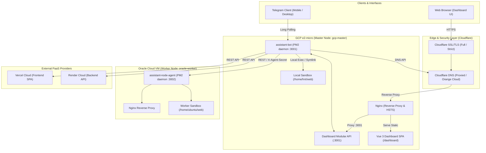

# Engineering Handoff Guide

> Comprehensive operational manual, system architecture reference, and maintenance runbook for the **Dev Assistant Bot & Multi-VPS Orchestrator**.

---

## 1. Executive Summary & Core Philosophy

The **Dev Assistant Bot & Multi-VPS Orchestrator** is a centralized DevOps automation platform and personal cloud orchestrator built with Node.js, Telegraf, Vue 3, and Nginx. It operates on a **Hub & Spoke Multi-VPS Cluster** model where a single Master Node (GCP e2-micro) coordinates Worker Nodes (such as Oracle Cloud Ampere A1), PaaS platforms (Vercel, Render), and DNS routing (Cloudflare).

### Core Architectural Pillars

1. **Zero-Overhead & Low Memory Footprint**:
   - Master bot memory footprint is capped under **100MB RAM** (actual usage ~20MB).
   - Worker Agent (`assistant-node-agent`) is built on native Node.js HTTP/REST with **zero heavy dependencies**, consuming **< 25MB RAM** (actual usage ~22MB).
   - Prevents Out-Of-Memory (OOM) crashes on resource-constrained free-tier VPS instances.
2. **Zero-Leakage Security & Secrets Hygiene**:
   - Zero tolerance for hardcoded tokens, passwords, private keys, or raw IP addresses.
   - All public IPs are automatically masked (`34.***.***.133`, `168.***.***.235`) on Telegram messages and Web Dashboard screens.
   - All credentials exist strictly in local, untracked `.env` files.
3. **Defense-in-Depth Terminal Isolation**:
   - The `/sh` terminal executes **strictly whitelisted commands** mapped to predefined safe aliases.
   - Rejects arbitrary shell command execution, chaining operators (`;`, `&&`, `|`), and shell injection vectors.
4. **Single Pane of Glass Control**:
   - Full operational parity between the Telegram Bot interface and the Web Dashboard (`https://bot.thienhn.io.vn/`).

---

## 2. High-Level Architecture & Cluster Topology



### Current Nodes Topology

| Node ID | Role | Provider / Specs | Internal Port | Public IP (Masked) | Responsibilities |
| :--- | :--- | :--- | :---: | :---: | :--- |
| `gcp-master` | Master | GCP e2-micro (1 vCPU, 1GB RAM) | `3001` | `34.***.***.133` | Telegram bot, Web Dashboard API, Nginx proxy, DNS orchestrator |
| `oracle-worker` | Worker | Oracle Cloud Ampere A1 (ARM64) | `3002` | `168.***.***.235` | Remote application hosting, sandbox PM2 apps, Nginx proxy |

The topology is defined in `data/nodes.json` (as an array, matching `data/nodes.example.json`):
```json
[
  {
    "id": "gcp-master",
    "name": "GCP e2-micro (Master)",
    "ip": "34.***.***.133",
    "isLocal": true,
    "status": "online"
  },
  {
    "id": "oracle-worker",
    "name": "Oracle Cloud VM",
    "ip": "168.***.***.235",
    "agentUrl": "http://168.***.***.235:3001",
    "secret": "env:NODE_AGENT_SECRET",
    "isLocal": false,
    "status": "online"
  }
]
```

---

## 3. Subsystem Breakdown

### 3.1. Telegram Bot Core (`bot.js`)
- **Framework**: Telegraf v4.
- **Middleware**: `config/middleware.js` verifies that `ctx.from.id` matches `process.env.AUTHORIZED_TELEGRAM_ID`. Unauthorized users receive zero response.
- **Command Dispatcher**: Dynamic loading of command handlers from `commands/`:
  - Cluster telemetry: `commands/status.js`, `commands/nodes.js`.
  - Deployment management: `commands/deploy.js`, `commands/deploy_web.js`, `commands/web_list.js`, `commands/web_remove.js`.
  - Safe terminal: `commands/sh.js`.
  - Operations & Diagnostics: `commands/restart.js`, `commands/update.js`, `commands/cleancache.js`, `commands/logs.js`, `commands/ps.js`, `commands/uptime.js`, `commands/perf.js`, `commands/notes.js`.

### 3.2. Worker Node Agent Daemon (`agent/server.js`)
- **Technology**: Native Node.js `http` module with no external framework dependencies.
- **Authentication**: `X-Agent-Secret` header matching `NODE_AGENT_SECRET`. Employs `crypto.timingSafeEqual` to prevent timing attacks.
- **Payload Limits**: 50MB for deployment ZIP uploads, 1MB for JSON payloads.
- **Exposed Endpoints**:
  - `GET /api/health`: Health status and agent uptime.
  - `GET /api/metrics`: CPU usage, memory stats, disk consumption, and load averages.
  - `POST /api/deploy`: Unpacks deployment ZIP, creates Nginx virtual host, restarts PM2 (if backend), reloads Nginx.
  - `POST /api/undeploy`: Removes project directory, removes Nginx configuration, reloads Nginx.
  - `POST /api/update`: Executes `git pull`, `npm install`, and restarts the agent via PM2.
  - `POST /api/sh`: Executes whitelisted terminal commands locally on the worker.

### 3.3. Safe Whitelisted Terminal (/sh)
- **Configuration**: Defined in `config/whitelist.js`.
- **Supported Aliases (15 Total)**:
  - **Hardware/System**: `/uptime`, `/disk-usage` (`df -h`), `/mem-check` (`free -h`), `/cpu-info` (`lscpu`), `/top-procs` (`ps aux --sort=-%mem`), `/os-release` (`cat /etc/os-release`).
  - **Network/Nginx**: `/netstat-listen` (`ss -tuln`), `/nginx-test` (`sudo nginx -t`), `/nginx-status` (`sudo systemctl status nginx`).
  - **PM2 Orchestration**: `/pm2-list` (`pm2 list`), `/pm2-status` (`pm2 status`), `/pm2-restart <app>`, `/pm2-logs <app>`.
  - **Version Control**: `/git-status` (`git status`), `/git-log` (`git log --oneline -5`).
- **Sanitization**: All terminal output is filtered through `stripAnsi` to remove ANSI escape sequences prior to sending to Telegram or the Web UI.

### 3.4. Multi-Target Deployment Engine (`lib/deployer.js`)
- **Target Matrix**:
  - `vps`: Local (`gcp-master`) or Remote (`oracle-worker`). Static files served by Nginx; backend apps executed by PM2. Cloudflare `A` record automatically provisioned.
  - `vercel`: Static frontend or SPA. Provisioned via Vercel REST API; Cloudflare `CNAME` record (`cname.vercel-dns.com`) automatically configured.
  - `render`: Backend Node.js Web Service. Provisioned via Render API; Cloudflare `CNAME` record automatically configured.
- **Repo Inspector (`lib/repoInspector.js`)**: Automatically detects project archetype:
  - `static_pure`: HTML/CSS/JS without build step -> Deploys to VPS Nginx.
  - `frontend_spa`: React/Vue/Vite/Next -> Deploys to Vercel.
  - `backend_api`: Express/Fastify/Nest -> Deploys to Render or VPS Worker.
  - `monorepo`: Splits into Frontend (Vercel) + Backend (Render).

### 3.5. Centralized Web Dashboard
- **Frontend Architecture**:
  - Static HTML shell: `dashboard/index.html` (includes HSTS, CSP upgrade-insecure-requests, FontAwesome, Chart.js, Tailwind CSS).
  - Client Application: `dashboard/app.js` (Vue 3 reactive single-page app, zero build step, edge-cached with `?v=2.1.0`).
- **Backend Architecture**:
  - Deconstructed modular controller hierarchy located in `services/dashboard/`:
    - `authController.js`: Google Identity Services (GIS) token verification, JWT cookie issuance, and session authentication.
    - `telemetryController.js`: Multi-node cluster metrics aggregation (`/api/status`, `/api/nodes`).
    - `terminalController.js`: Whitelisted command execution routing between local master and remote workers.
    - `deploymentsController.js`: Service registry querying, GitHub inspect, and deployment orchestration.
    - `notesController.js`: Operator notes persistence.
    - `perfController.js`: Local `curl -w` breakdown + remote Google PageSpeed Insights.
- **Security & Headers**:
  - HSTS enabled: `Strict-Transport-Security: max-age=31536000; includeSubDomains; preload`.
  - Security headers: `X-Content-Type-Options: nosniff`, `X-Frame-Options: SAMEORIGIN`.
  - CSP: `<meta http-equiv="Content-Security-Policy" content="upgrade-insecure-requests">`.

---

## 4. Directory Structure & Key Files

```text
assistant-bot/
├── agent/                         # Worker Node Micro-Daemon
│   ├── agentSandbox.js            # Worker sandbox, PM2, and Nginx manager
│   ├── package.json               # Worker dependencies (zero external dependencies)
│   └── server.js                  # Worker HTTP REST API server (:3002)
├── commands/                      # Telegram Bot Command Modules
│   ├── cleancache.js              # Clear system cache and temp files
│   ├── deploy.js                  # ZIP and interactive deployment handler
│   ├── deploy_web.js              # Web deployment wizard
│   ├── ip.js                      # Report public IP
│   ├── logs.js                    # Query application logs
│   ├── nodes.js                   # Cluster node status and listing
│   ├── notes.js                   # Developer notebook commands
│   ├── perf.js                    # Latency and PageSpeed benchmarking
│   ├── ps.js                      # Process status inspector
│   ├── restart.js                 # Restart bot PM2 instance
│   ├── sh.js                      # Whitelisted terminal runner
│   ├── start.js                   # Welcome and command directory
│   ├── status.js                  # Real-time multi-node telemetry
│   ├── update.js                  # Git pull and PM2 cluster updater
│   ├── uptime.js                  # System uptime display
│   ├── web_list.js                # List all active deployed websites
│   └── web_remove.js              # Decommission website and clean DNS
├── config/                        # Configuration & Shared Utilities
│   ├── env.js                     # Environment variable validation
│   ├── middleware.js              # Telegram user whitelist middleware
│   ├── utils.js                   # String formatting, HTML escaping, date utils
│   └── whitelist.js               # Whitelisted DevOps terminal aliases
├── dashboard/                     # Web Dashboard SPA
│   ├── app.js                     # Vue 3 application logic and state
│   └── index.html                 # Dashboard markup, CSS, and CSP headers
├── data/                          # Persistent State (JSON Stores)
│   ├── deployments.json           # Active deployments registry
│   ├── nodes.json                 # Cluster node registry and configuration
│   └── notes.json                 # Developer notes storage
├── handlers/                      # Telegraf Event Handlers
│   └── textHandler.js             # Text and GitHub URL detection handler
├── lib/                           # Core Business Logic Libraries
│   ├── deployer.js                # Multi-target deployment routing orchestrator
│   ├── deployStore.js             # Deployment state file read/write operations
│   ├── nodeClient.js              # Master-to-Worker REST HTTP client
│   ├── nodeManager.js             # Cluster topology registry manager
│   ├── perf.js                    # cURL TTFB and PageSpeed analyzer
│   ├── repoInspector.js           # GitHub project structure classifier
│   ├── sandbox.js                 # Local VPS web directory and Nginx manager
│   └── providers/                 # Cloud Provider API Clients
│       ├── cloudflare.js          # Cloudflare DNS API client (A & CNAME records)
│       ├── render.js              # Render API client
│       └── vercel.js              # Vercel API client
├── services/                      # Background Daemons & API Services
│   ├── dashboardApi.js            # Central dashboard HTTP server routing
│   ├── watchdog.js                # Memory, CPU, and disk monitoring alert daemon
│   └── dashboard/                 # Modular Dashboard API Controllers
│       ├── authController.js      # Google OAuth and JWT authentication
│       ├── deploymentsController.js # Deployments management and Git triggers
│       ├── notesController.js     # Notes management API
│       ├── perfController.js      # Performance testing API
│       ├── telemetryController.js # Cluster telemetry and node metrics API
│       └── terminalController.js  # Safe terminal execution API
├── test/                          # Comprehensive Test Suites (25 Suites)
├── AGENTS.md                      # AI Coding Agent operating standards
├── CONTEXT.md                     # Canonical domain terminology
├── HANDOFF.md                     # This handoff documentation
├── README.md                      # Public project documentation
├── ecosystem.config.js            # PM2 production configuration
└── package.json                   # Project manifest and test runner scripts
```

---

## 5. Environment Variables & Secrets Reference

All secrets must be maintained strictly in `.env`. Never commit `.env` or paste real secrets into commit logs.

### 5.1. Master Node `.env` (GCP)
```bash
# Telegram Configuration
BOT_TOKEN="123456789:ABCdefGhIJKlmNoPQRsTUVwxyZ"
AUTHORIZED_TELEGRAM_ID="123456789"

# Domain & Cloudflare DNS Configuration
BASE_DOMAIN="thienhn.io.vn"
CLOUDFLARE_API_TOKEN="cf_api_token_here"
CLOUDFLARE_ZONE_ID="cloudflare_zone_id_here"
VPS_PUBLIC_IP="34.***.***.133"

# Web Dashboard & Authentication
GOOGLE_CLIENT_ID="*.apps.googleusercontent.com"
AUTHORIZED_GOOGLE_EMAIL="operator@gmail.com"
SESSION_SECRET="super_long_random_jwt_secret_key"
DASHBOARD_PORT=3001

# Multi-VPS Cluster Secret (Must match Worker)
NODE_AGENT_SECRET="cluster_shared_secret_token"

# External PaaS Integrations (Optional)
VERCEL_TOKEN="vercel_token_here"
RENDER_API_KEY="rnd_key_here"
RENDER_OWNER_ID="usr_id_here"

# Runtime Environment
NODE_ENV="production"
PM2_PROCESS_NAME="assistant-bot"
WEB_DEPLOY_DIR="/home/hnt/web"
```

### 5.2. Worker Node `.env` (Oracle Cloud / `agent/.env`)
```bash
# Worker Agent Port & Secret
PORT=3002
NODE_AGENT_SECRET="cluster_shared_secret_token" # Must match Master

# Deployment Settings
WEB_DEPLOY_DIR="/home/ubuntu/web"
NODE_ENV="production"
```

---

## 6. Operational Runbooks (SOPs)

### SOP 1: Deploying Updates to the Master Node (GCP)
1. **Connect via SSH**:
   ```bash
   ssh -i ~/.ssh/gcp_key hnt@34.***.***.133
   ```
2. **Pull updates and verify**:
   ```bash
   cd ~/app/telegram-bot
   git checkout main
   git pull origin main
   npm run check:syntax
   npm test
   ```
3. **Restart Master PM2 Service**:
   ```bash
   pm2 restart assistant-bot
   pm2 logs assistant-bot --lines 30
   ```

### SOP 2: Deploying Updates to the Worker Node (Oracle Cloud)
1. **Via Centralized Telegram Bot / Dashboard (Preferred)**:
   - Run `/update oracle-worker` in Telegram, or click the Update button in Dashboard.
2. **Via Direct SSH (Fallback)**:
   ```bash
   ssh -i /path/to/oracle_key ubuntu@168.***.***.235
   cd ~/app/telegram-bot
   git checkout main
   git pull origin main
   pm2 restart assistant-node-agent
   pm2 logs assistant-node-agent --lines 30
   ```

### SOP 3: Enrolling a New Worker Node into the Cluster
1. **Provision New VPS** (Ubuntu/Debian):
   - Install Node.js (>= 18.x), PM2, and Nginx.
   - Configure Nginx wildcard/virtual hosts to serve from `/home/<user>/web`.
2. **Deploy the Worker Agent**:
   ```bash
   git clone https://github.com/ThienHN0910/assistant-bot.git
   cd assistant-bot/agent
   npm install --production
   cp .env.example .env
   # Edit .env with PORT=3002 and the matching NODE_AGENT_SECRET
   pm2 start server.js --name "assistant-node-agent" --max-memory-restart 100M
   pm2 save
   ```
3. **Open Firewall Port**:
   - Ensure port `3002` allows incoming TCP traffic from the GCP Master IP (`34.***.***.133`).
4. **Register in Master Node Topology**:
   - Append the new node entry to the array in `data/nodes.json` on the Master Node:
     ```json
     {
       "id": "new-worker-id",
       "name": "New Worker VPS",
       "ip": "public_ip_of_new_node",
       "agentUrl": "http://public_ip_of_new_node:3001",
       "secret": "env:NODE_AGENT_SECRET",
       "isLocal": false,
       "status": "online"
     }
     ```
   - Run `/nodes` on Telegram or refresh the Web Dashboard to verify immediate discovery.

### SOP 4: PM2 Operations & Health Checks
- View process table: `pm2 list` or execute `/pm2-list` in the Terminal.
- View detailed telemetry: `pm2 show assistant-bot`.
- Tail logs: `pm2 logs assistant-bot --lines 50`.
- Memory threshold: If memory usage exceeds 100MB, PM2 will automatically reboot the instance (`--max-memory-restart 100M`).

### SOP 5: Nginx SSL & HSTS Management
- Nginx configuration on Master resides at `/etc/nginx/sites-available/bot.thienhn.io.vn`.
- Cloudflare Origin CA certificate installed at `/etc/ssl/certs/cloudflare_origin.pem` and `/etc/ssl/private/cloudflare_origin.key`.
- Verify configuration syntax before reloading:
  ```bash
  sudo nginx -t
  sudo systemctl reload nginx
  ```
- Test HSTS header enforcement:
  ```bash
  curl -Iv https://bot.thienhn.io.vn/ | grep -i strict-transport-security
  ```

### SOP 6: Incident Response & Troubleshooting

| Symptom | Probable Cause | Remediation Steps |
| :--- | :--- | :--- |
| **HTTP 502 Bad Gateway on `bot.thienhn.io.vn`** | Master PM2 process crashed or port 3001 is offline | SSH to GCP, run `pm2 status`. Check `pm2 logs assistant-bot`. Restart with `pm2 restart assistant-bot`. |
| **Worker node shows "Offline" in `/nodes`** | Worker agent crashed or firewall blocked port 3002 | Check firewall on Worker: `sudo ufw status`. Verify `pm2 status` on Worker. Test reachability from Master: `curl http://<worker_ip>:3002/api/health`. |
| **Terminal rejects command: "not recognized"** | Command is not in whitelist | Check `config/whitelist.js`. Add the command if safe, or use pre-approved aliases. |
| **Google Login Error: 403 Forbidden** | User email does not match `AUTHORIZED_GOOGLE_EMAIL` | Verify `.env` on Master. Only the registered owner email is allowed. |
| **Cloudflare DNS resolution failure** | Token expired or Zone ID mismatch | Verify `CLOUDFLARE_API_TOKEN` permissions (`Zone.DNS:Edit`). Check `data/deployments.json` for orphaned record IDs. |

---

## 7. Verification & Quality Assurance Gates

Before committing any modifications or deploying changes, execute the following commands locally:

```bash
# 1. Syntax integrity check across all source files
npm run check:syntax

# 2. Run all 25 unit, integration, and security test suites
npm test
```

All 25 test suites must pass with **0 errors and 0 warnings**:
1. `test/whitelist.test.js` - Safe terminal aliases validation.
2. `test/utils.test.js` - Utility helpers, escaping, string sanitation.
3. `test/monitoring.test.js` - System information collection.
4. `test/sandbox.test.js` - Local web deployment sandbox and Nginx generator.
5. `test/perf.test.js` - cURL latency and Google PageSpeed calculations.
6. `test/cloudflare.test.js` - Cloudflare DNS A and CNAME operations.
7. `test/deployer.test.js` - Core deployment engine multi-target routing.
8. `test/telegram_deploy.test.js` - Telegram deployment workflows.
9. `test/deploy_store_exit.test.js` - Deployment registry persistence and timers.
10. `test/env_security.test.js` - Secret exposure checks and environment sanitation.
11. `test/repo_inspector.test.js` - GitHub repository classification.
12. `test/github_vps_deploy.test.js` - Direct GitHub-to-VPS deployment flow.
13. `test/monorepo_telegram.test.js` - Monorepo detection and deployment keyboard.
14. `test/dashboard_api.test.js` - Dashboard authentication and API endpoints.
15. `test/vercel_file_deploy.test.js` - Direct Vercel deployment pipeline.
16. `test/update_command.test.js` - Git update and PM2 restart operations.
17. `test/node_manager.test.js` - Cluster node topology and IP masking.
18. `test/worker_agent.test.js` - Worker micro-daemon REST endpoints and size checks.
19. `test/node_client.test.js` - Master-to-Worker REST HTTP client.
20. `test/multi_vps_deployer.test.js` - Multi-target VPS routing and Cloudflare A records.
21. `test/multi_vps_telegram.test.js` - Multi-node Telegram `/status`, `/nodes`, and `/update`.
22. `test/dashboard_multi_vps.test.js` - Dashboard multi-node telemetry and target selection.
23. `test/multi_vps_commands.test.js` - Command routing between master and remote workers.
24. `test/start_and_weblist.test.js` - Telegram start directory and interactive web lists.
25. `test/dashboard_full_features.test.js` - Full suite of dashboard controllers and operations.

---

## 8. Future Roadmap & Ongoing Evolution

- [ ] **Automated Node Health Alerts**: Background heartbeat monitor that notifies Telegram immediately if any cluster node becomes unreachable.
- [ ] **Worker Docker Sandboxing**: Optional lightweight Docker isolation for worker nodes running complex untrusted multi-service applications.
- [ ] **Automated GitHub Webhooks**: Allow registered repositories to push updates directly to the deployment engine without manual operator triggers.
- [ ] **Zero-Downtime Blue/Green Swaps**: Instantaneous Nginx upstream switching for backend applications during redeployments.
