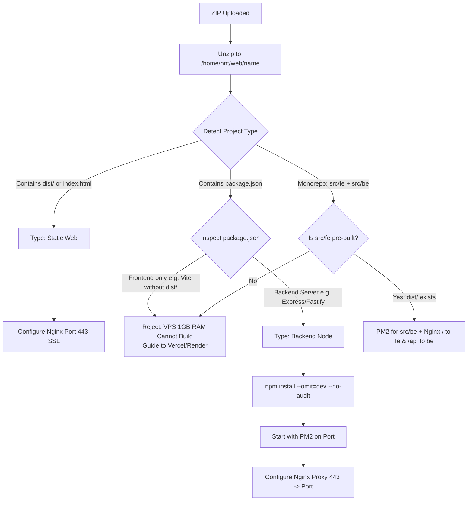
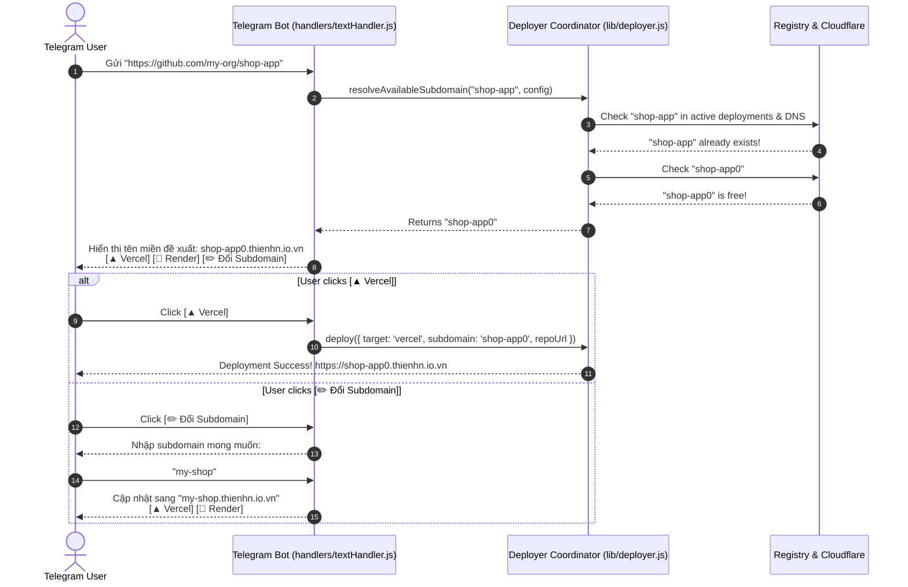
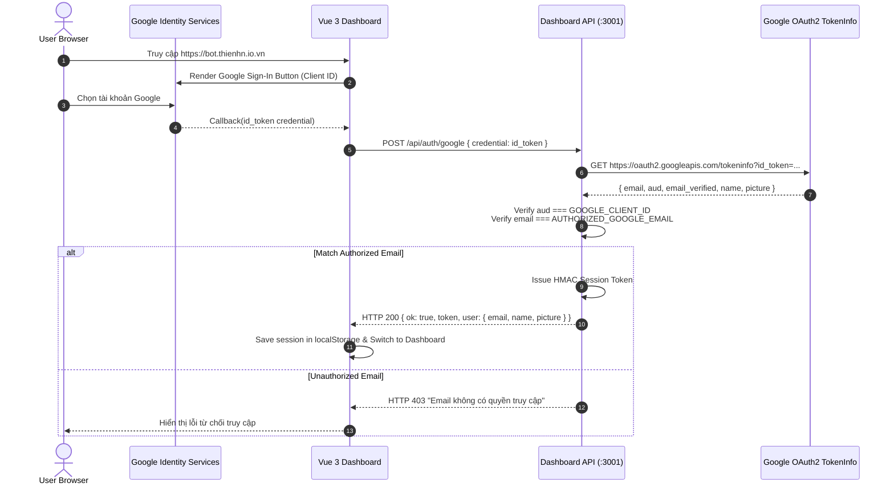

# Enhanced Multi-Target Deployment & Google OAuth Architecture

> **Date:** 2026-09-24  
> **Status:** Proposed  
> **Scope:** Cloudflare Origin SSL, Monorepo & RAM-safe Deployments, 1-Click GitHub Subdomain Collision, Google OAuth 2.0 Auth for Dashboard

---

## 1. Context & Objectives

The Assistant Bot has implemented multi-target deployments (VPS, Vercel, Render) and a Vue 3 monitoring dashboard. Based on runtime considerations on GCP (1 vCPU, 1GB RAM) and security reviews, this specification defines four key upgrades:

1. **RAM-Safe VPS Deployment Rule (Zero `npm run build` on VPS):**
   - With 1GB RAM, running frontend bundling tools (Vite, Webpack, Next.js build) causes Out-Of-Memory (OOM) crashes.
   - Frontend apps deployed to VPS must already contain pre-built artifacts (`dist/` or static `index.html`).
   - Node.js backend projects install production dependencies only (`npm install --omit=dev`).
   - Unbuilt frontend repositories must be guided to Vercel or Render.

2. **Cloudflare Origin SSL Template for Nginx:**
   - Server already has Cloudflare Origin Certificate at `/etc/ssl/certs/cloudflare_cert.pem` and `/etc/ssl/private/cloudflare_key.key`.
   - Update Nginx config generation to listen on port 443 with TLS 1.2/1.3, and redirect port 80 to 443 (HTTP 301).

3. **1-Click GitHub Deploy with Subdomain Collision Handling:**
   - Detect GitHub URL input $\to$ auto-derive subdomain from repository name.
   - Auto-resolve collisions: if `repo` exists, try `repo0`, then `repo1`, `repo2`...
   - Present 1-click deploy buttons for Vercel and Render with option to manually customize subdomain.

4. **Exclusive Google OAuth 2.0 Authentication for Web Dashboard:**
   - Deprecate and remove plain secret key authentication.
   - Integrate Google Identity Services (GIS) on Vue 3 Dashboard.
   - Backend verification of Google ID token against `AUTHORIZED_GOOGLE_EMAIL` and `GOOGLE_CLIENT_ID`.
   - Issue HMAC session tokens for authenticated API sessions.

---

## 2. Architecture & Component Design

### 2.1. RAM Protection & Monorepo Detection (`lib/sandbox.js`)



#### Detailed Validation Rules:
- A project is recognized as **Frontend-only (requiring build)** if `package.json` contains build tools like `vite`, `@vitejs/plugin-react`, `react-scripts`, `@vue/cli`, and lacks server frameworks (`express`, `fastify`, `koa`, `nest`, `hono`).
- If no pre-built `dist/` is found, deployment aborts with:
  `"Dự án là Frontend chưa build (chưa có dist/). Máy chủ VPS (1GB RAM) không hỗ trợ chạy build. Vui lòng build local trước khi nén ZIP, hoặc triển khai qua Vercel/Render."`

### 2.2. Cloudflare Origin SSL Nginx Template (`lib/sandbox.js`)

For both static and backend services:
```nginx
# 1. Chuyển hướng toàn bộ HTTP sang HTTPS
server {
    listen 80;
    server_name <domain>;
    return 301 https://$host$request_uri;
}

# 2. Xử lý HTTPS với chứng chỉ Cloudflare Origin
server {
    listen 443 ssl;
    server_name <domain>;

    ssl_certificate /etc/ssl/certs/cloudflare_cert.pem;
    ssl_certificate_key /etc/ssl/private/cloudflare_key.key;

    ssl_protocols TLSv1.2 TLSv1.3;
    ssl_ciphers HIGH:!aNULL:!MD5;

    # [Static Root OR Proxy Pass Block]
    ...

    gzip on;
    gzip_types text/plain text/css application/json application/javascript text/xml application/xml text/javascript;
}
```

### 2.3. Subdomain Collision Resolution & 1-Click Telegram UX



#### Collision Suffix Algorithm (`resolveAvailableSubdomain`):
1. Clean string: `base = name.toLowerCase().replace(/[^a-z0-9-]/g, '')`.
2. Check if `base` exists in existing deployments or Cloudflare records.
3. If not exists $\to$ return `base`.
4. If exists $\to$ test `base + '0'`. If that exists $\to$ increment index: `base + '1'`, `base + '2'`, etc.

### 2.4. Google OAuth 2.0 Exclusive Authentication



#### Configuration Changes (`.env.example`):
- `GOOGLE_CLIENT_ID`: Your Google OAuth 2.0 Client ID (from Google Cloud Console).
- `AUTHORIZED_GOOGLE_EMAIL`: The exclusive email allowed to log in (e.g. `thienhn.dev@gmail.com`).
- Deprecated & Removed: `DASHBOARD_SECRET_KEY`.

---

## 3. Implementation Plan & File Changes

| File | Change Scope |
|------|--------------|
| [`lib/sandbox.js`](file:///E:/workspace/srcPrj/assistant-bot/lib/sandbox.js) | Upgrade `generateNginxConfig` to HTTPS 443 with Cloudflare Origin SSL & 80->443 redirect. Update `detectProjectType` to forbid `npm run build` on unbuilt frontend projects. |
| [`lib/deployer.js`](file:///E:/workspace/srcPrj/assistant-bot/lib/deployer.js) | Add `resolveAvailableSubdomain` with collision index logic (`repo`, `repo0`, `repo1`...). |
| [`handlers/textHandler.js`](file:///E:/workspace/srcPrj/assistant-bot/handlers/textHandler.js) | Update GitHub detection UX: auto-calculate collision-free subdomain, 1-click deploy buttons, and custom subdomain input state. |
| [`commands/deploy.js`](file:///E:/workspace/srcPrj/assistant-bot/commands/deploy.js) | Update callback action handlers to support 1-click deployment with auto-subdomain and custom prompt. |
| [`services/dashboardApi.js`](file:///E:/workspace/srcPrj/assistant-bot/services/dashboardApi.js) | Remove secret key auth. Implement `/api/auth/google` with Google token verification and HMAC session management. |
| [`dashboard/index.html`](file:///E:/workspace/srcPrj/assistant-bot/dashboard/index.html) | Integrate Google Identity Services button, remove password input form, display logged-in Google profile. |
| [`config/env.js`](file:///E:/workspace/srcPrj/assistant-bot/config/env.js) & [`.env.example`](file:///E:/workspace/srcPrj/assistant-bot/.env.example) | Add `GOOGLE_CLIENT_ID` and `AUTHORIZED_GOOGLE_EMAIL`, deprecate `DASHBOARD_SECRET_KEY`. |
| `test/` | Update & add tests for subdomain collision, Google auth verification, and HTTPS Nginx template generation. |

---

## 4. Verification & Testing Strategy

1. **Unit & Integration Tests:**
   - Test subdomain collision resolution (`name` $\to$ `name0` $\to$ `name1`).
   - Test Nginx HTTPS config generation checking port 80 301 redirect and port 443 SSL paths.
   - Test project type detection rejects unbuilt frontend projects with 1GB RAM warning.
   - Test Google auth endpoint verifying valid/invalid emails and tokens.
2. **Local Verification Gate:**
   - `npm run check:syntax`
   - `npm test`
